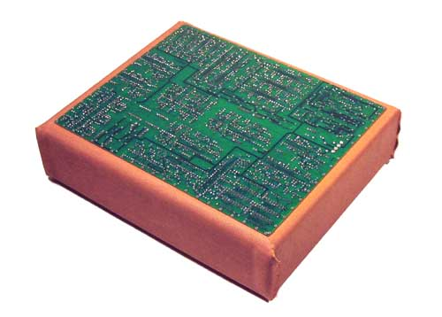
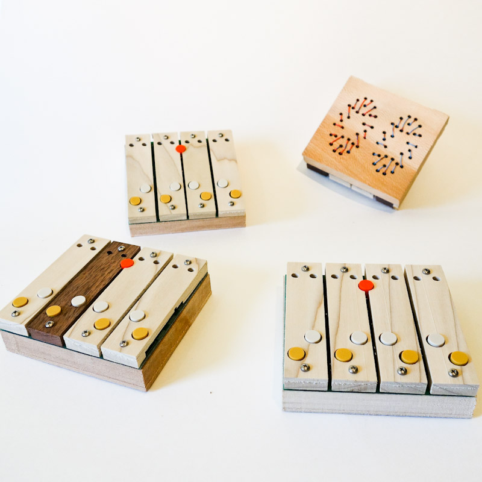
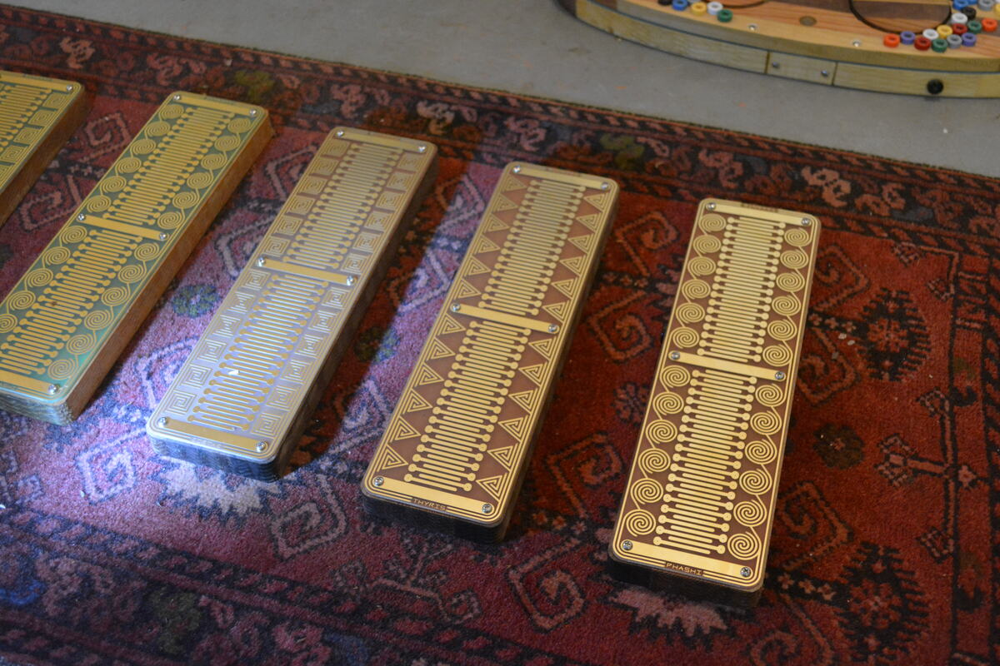
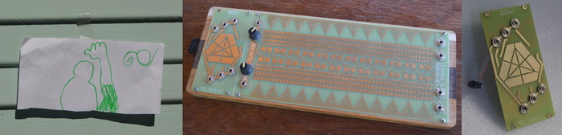

<table>
<tr><td align=right> In 2003, as part of a grant from the Daniel Langlois foundation, I constructed and performed a Shinth, an instrument designed for circuit bending. <td>

<tr><td align=right>  <td> I started Ciat-Lonbarde in 2003, with the ambrazier series of digital delay instruments, which became tranoe, cocolase, cocostuber, then cocoquantus, and finally cafe quantum. 
<tr><td align=right>   <td> I started Ciat-Lonbarde in 2003, with the ambrazier series of digital delay instruments, which became tranoe, cocolase, cocostuber, then cocoquantus, and finally cafe quantum. 
<tr><td align=right>Ciat-Lonbarde also released kits for the fourses and fyral which are played by touch and other circuit bending techniques. <td align=left>  
<tr><td align=right>  <td> Ciat-Lonbarde also released the sidrassi, sidrazzi, and tetrazzi, which became the sidrax and tetrax that are available today.

 <tr><td colspan=2 align=center> 
  <tr><td colspan=2 align=center>Deerhorn started as a series of hanging instruments to explore invisible (radio) fields in space
  <tr><td align=right><td> It became the Deerhorn and Tierhorn series of instruments.
<tr><td align=right> Steve Korn and I started Shbobo in the Fall of 2010, which focused exclusively on gestural instruments for USB. <td>   
 <tr><td align=right>  <td>Shnth and Tarsh (Shtar) are the two results.
  <tr><td colspan=2 align=center> 
<tr><td align=left><td>The Tocante line of musical instruments is "about" and "touching" the materials of electronics. Each touchpad represents a pitch according to industry "preferred numbers," chosen by old wartime engineers for non-musical purposes. Here they form a unique and haunting musical scale, not unlike that of a gamelan or the neutral intervals of Persian music. Beyond these base pitches, three golden sandrodes flank each touchpad; touching these androgynous nodes yields intermodulation, pitch and timbral shifts, and emergent chaotic masses. The instruments come in three flavors: thyris the triangle, bistab the square, and phashi the circle. The oscillators sound like a bowed string, a most powerful clarinet, and a howling serene whistle, respectively. Each responds to touch differently. Solar panels charge the onboard batteries, that power the oscillators and a speaker. They are the perfect self-contained instrument for nightly music at the campground.
<tr><td align=right>It is also available in red, and other flavors: zenert is filtered noise, karper is karpluss-strong, and studworth is the kit.<td align=right>
<tr><td colspan=2 align=center> 
<tr><td align=center> Ieaskul F. Mobenthey is a series of modules in the Eurorack format.

