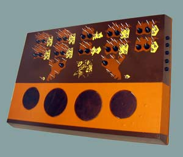
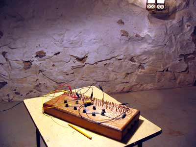
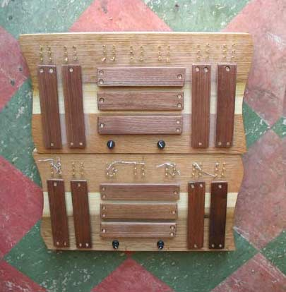
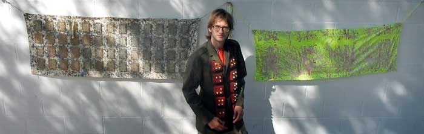
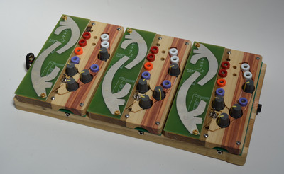
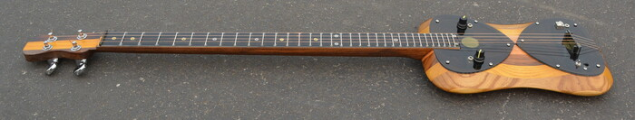
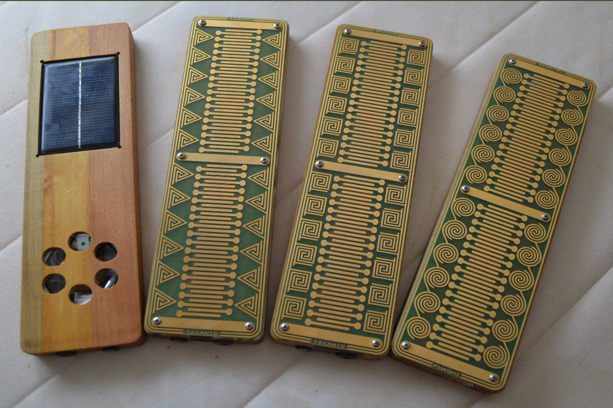

So we are now at the page of peter blasser who designs the instruments of Ciat-Lonbarde, Shbobo, Tocante, Ieakul F. Mobenthey, and so on.
They are available at [Patch Point](https://patch-point.com/).
If you are interested in publishing portions (sound, images) of the old site, please get in touch.

## Some Repositories For YOu
&#11044; [SHBOBO](https://github.com/pblasser/shbobo/)
&#11044; [ESP_CAFE](https://github.com/pblasser/esp_cafe/)
&#11044; [CLAWYER](https://github.com/pblasser/clawyer/)
&#11044; [SUPERCOLLIDER](https://github.com/pblasser/supa/)
&#11044; [SKETCHUP](https://github.com/pblasser/sketch2023/)
&#11044;

## Some Manuals For you
&#11044; [CAFETERIA_MANUAL](https://docs.google.com/document/d/1D_CIZHTju4iy1mDPrkbwnlVWf3Rq46L3JqkUNoO1eGQ/)
&#11044; NORTUBE
&#11044;

### Older Ciat Lonbarde Documents
&#11044; [Cocoquantus](pdf/cq_scheme.pdf)
&#11044; [Cocostuber](pdf/cs_manual.pdf)
&#11044; [On_Piezos](pdf/piezo.pdf)
&#11044; [Plumbutter](pdf/pb_scheme.pdf)
&#11044; [Studworth25](pdf/studworth25.pdf)
&#11044; [studworth.scd](studworth.scd)
### Ieaskul F. Mobenthey
&#11044; [Barre](pdf/ifmBAR.pdf)
&#11044; [Denum](pdf/ifmDEN.pdf)
&#11044; [Dunst](pdf/ifmDUN.pdf)
&#11044; [Fourses](pdf/ifmFRS.pdf)
&#11044; [Grassi](pdf/ifmGRA.pdf)
&#11044; [Mocante](pdf/ifmMOC.pdf)
&#11044; [Sprott](pdf/ifmSPR.pdf)
&#11044; [Swoop](pdf/ifmSWO.pdf)
&#11044;
### Paper Circuits
&#11044; [Fourses](pdf/fourses.pdf)
&#11044; [Mister_Grassi](pdf/grassi.pdf)
&#11044;

## Some Articles For you
&#11044; [Masters_thesis](https://digitalcollections.wesleyan.edu/_flysystem/fedora/2023-03/17013-Original%20File.pdf) &#11044; [backup](pdf/pb_mast.pdf)
&#11044; [Oval_Synth](https://econtact.ca/17_4/blasser_ovalsynth.html)
&#11044; [Solar_Sounders](https://econtact.ca/18_3/blasser_solarsounder.html)
&#11044;
## Coloring Projects
&#11044; [Computer_Music_Coloring_Papers](pdf/cmloring.pdf)
&#11044; [Ciat_Lonbarde_Coloring_Book](pdf/coloring.pdf)
&#11044; [Deerhorn](pdf/deerhorn.pdf)
&#11044; [Deertick](pdf/deertick.pdf)
&#11044; [Runes](pdf/runes.pdf)
&#11044; [Songs](pdf/songs.pdf)
&#11044; [Spells](pdf/spells.pdf)
&#11044; [Trashnite](pdf/trashnite.pdf)
&#11044;
## Songs
&#11044; [otsink](mp3/otsink.mp3)
&#11044; [din_datin_dudero](mp3/11DinDatinDudero.mp3)
&#11044; [the_mono](mp3/10Mono.mp3)
&#11044; [AV_dog](mp3/04AVDog.mp3)
&#11044; [dont_b_distrbd_by_the_presence_of_wire](mp3/12wire.mp3)
&#11044; [the_tube_thru_which_you_squeeze_ur_jelly_ass](mp3/yourjellyass.mp3)
&#11044; [goodbye](mp3/15goodbye.mp3)
&#11044;
## Links
&#11044; [blogspot](https://petermopar.blogspot.com/)
&#11044; [youtube](https://www.youtube.com/petermopar) 
&#11044; [instagram](https://www.instagram.com/ciat_lonbarde)
&#11044; 

##About

<table>
<tr><td>   <td> I started Ciat-Lonbarde in 2003, with the ambrazier series of digital delay instruments, which became tranoe, cocolase, cocostuber, then cocoquantus, and finally cafe quantum. 
<tr><td>Ciat-Lonbarde also released kits for the fourses and fyral which are played by touch and other circuit bending techniques. <td>  
<tr><td>  <td> Ciat-Lonbarde also released the sidrassi, sidrazzi, and tetrazzi, which became the sidrax and tetrax that are available today.
 <tr><td colspan=2> 
  <tr><td colspan=2>Deerhorn started as a series of hanging instruments to explore invisible (radio) fields in space
  <tr><td><td> It became the Deerhorn and Tierhorn series of instruments.
<tr><td> Steve Korn and I started Shbobo in the Fall of 2010, which focused exclusively on gestural instruments for USB. <td>   
 <tr><td colspan=2> SHNTH and TARSH (SHTAR) are the two results.
  <tr><td colspan=2> 
<tr><td><td>The Tocante line of musical instruments is "about" and "touching" the materials of electronics. Each touchpad represents a pitch according to industry "preferred numbers," chosen by old wartime engineers for non-musical purposes. Here they form a unique and haunting musical scale, not unlike that of a gamelan or the neutral intervals of Persian music. Beyond these base pitches, three golden sandrodes flank each touchpad; touching these androgynous nodes yields intermodulation, pitch and timbral shifts, and emergent chaotic masses. The instruments come in three flavors: thyris the triangle, bistab the square, and phashi the circle. The oscillators sound like a bowed string, a most powerful clarinet, and a howling serene whistle, respectively. Each responds to touch differently. Solar panels charge the onboard batteries, that power the oscillators and a speaker. They are the perfect self-contained instrument for nightly music at the campground.
<tr><td>It is also available in red.<td>
<tr><td colspan=2> 
<pre><i>
coco jibral
I enter my ghost into the cocolase,
the cocolase dances its tube,
that thru which I squeeze,
am stuck forever bent by the multo wheels
and free spinnet balls of the sidrassi.
Sidrassi spin, not grinding but wobbling
through Nodemesnes' meaning jelly.
Most fields of the jelly are empty,
or filled with papers scraps, cat hair, crayons, and lots of candy.
Nodemesnes meant that the meaningless jelly is unreal.
So you have not truly arrived at the ancient areas of the jelly,
even when you hear scraps of the whispers and warnings made in the darkened house:
sine pellatio felliniarum
muni cassadi
killers
you -- joseph
</i></pre>
Nodemesnes said "people can't dwell in my meaningless jelly unless it's real --
when you squirm through it to a clearing where you hear alien voices,
these are your own voice transposed to the darkened house.
The sidrassi shatter your path thru the jelly,
bending you into a field of trash and paper scraps."
</table>
