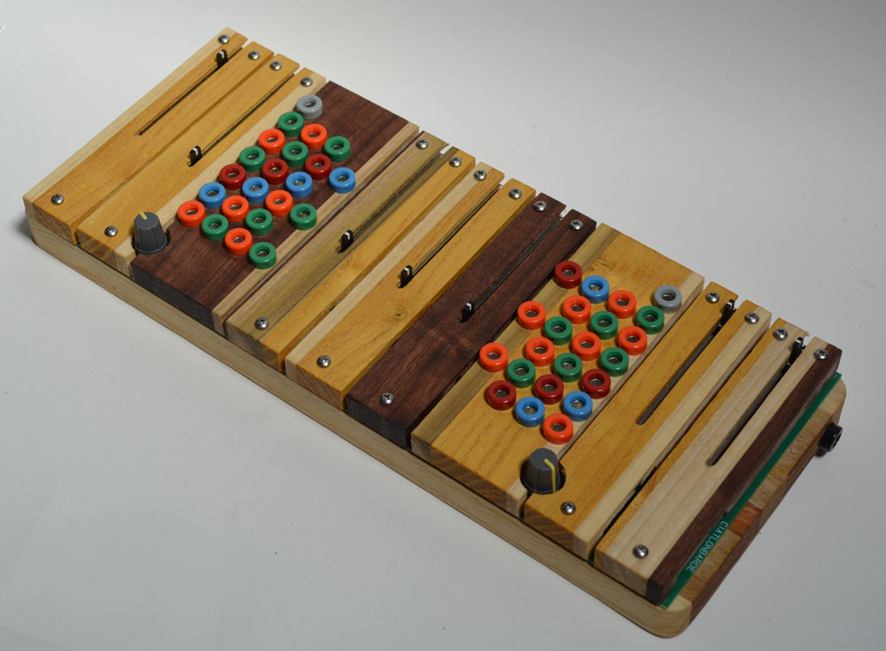

So we are now at the page of peter blasser who designs the instruments of ciat-lonbarde, shbobo, tocante, ieakul f. mobenthey, and so on.
They are currently available at patch point
If you are interested in publishing portions (sound, images) of the old site, please get in touch.

## Some Repositories For YOu
+ [SHBOBO](https://github.com/pblasser/shbobo/)
+ [ESP_CAFE](https://github.com/pblasser/esp_cafe/)
+ [CLAWYER](https://github.com/pblasser/clawyer/)
+ [SUPERCOLLIDER](https://github.com/pblasser/supa/)
+ [SKETCHUP](https://github.com/pblasser/sketch2023/)

## Some Manuals For you
+ [CAFETERIA MANUAL](https://docs.google.com/document/d/1D_CIZHTju4iy1mDPrkbwnlVWf3Rq46L3JqkUNoO1eGQ/)
coming soon nortube

### Ieaskul F. Mobenthey
+ [Barre](pdf/ifmBAR.pdf)
+ [Denum](pdf/ifmDEN.pdf)
+ [Dunst](pdf/ifmDUN.pdf)
+ [Fourses](pdf/ifmFRS.pdf)
+ [Grassi](pdf/ifmGRA.pdf)
+ [Mocante](pdf/ifmMOC.pdf)
+ [Sprott](pdf/ifmSPR.pdf)
+ [Swoop](pdf/ifmSWO.pdf)

## Some Articles For you
+ [Stores at the Mall](https://digitalcollections.wesleyan.edu/_flysystem/fedora/2023-03/17013-Original%20File.pdf)
+ [Oval Synth](https://econtact.ca/17_4/blasser_ovalsynth.html)
+ [Solar Sounders](https://econtact.ca/18_3/blasser_solarsounder.html)

